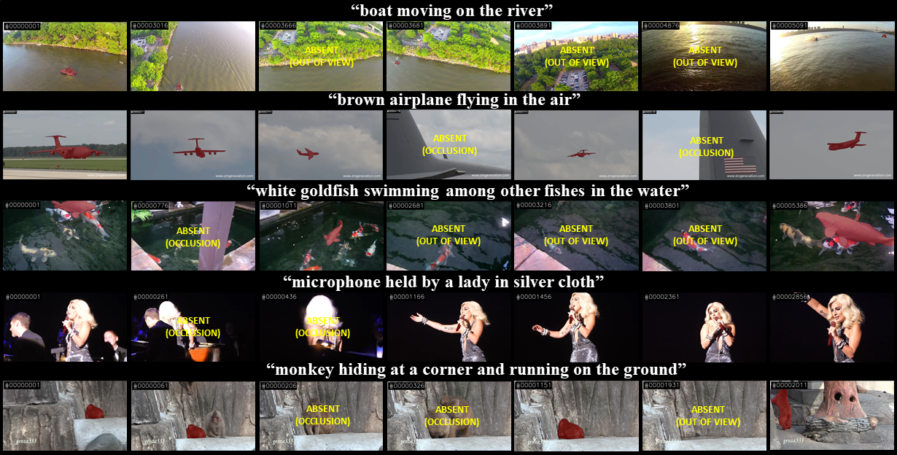

# LVOS: A Benchmark for Long-term Video Object Segmentation

[<a href="https://lingyihongfd.github.io/lvos.github.io/">Home Page</a>] [<a href="https://arxiv.org/abs/2211.10181">Paper</a>]

LVOS is a benchmark for long-term video object segmentation. LVOS consists of 220 videos, 120 for training(annotations public), 50 for validation(annotations public) and 50 for testing(annotations unpublic). LVOS provides each video with high-quality and dense pixel-wise annotation.



## Dataset

Download LVOS dataset from Google Drive ( <a href="https://drive.google.com/file/d/1pdA1Y7-VE4coj6yacya-kolZs6hKuQpS/view?usp=share_link">Train</a> | <a href="https://drive.google.com/file/d/1msjV2AAKROc-UsXh8lUic2gQpsLKfjQ0/view?usp=share_link">Eval</a> | <a href="https://drive.google.com/file/d/1zp8uqiby3o-2jSjZOqQx4ILh-LLqTz-0/view?usp=share_link"> Test</a> ), Baidu Drive ( <a href="https://pan.baidu.com/s/1DUB27_fJO1iNmRfTYjjLkw?pwd=nff5">Train</a> | <a href="https://pan.baidu.com/s/1XAuBUvD2GFcbavVQyzgpdg?pwd=y1kr">Eval</a> | <a href="https://pan.baidu.com/s/1ObwZPfr2brPCmJ9MV89Neg?pwd=awlh">Test</a> ), or Kaggle (<a href="https://www.kaggle.com/datasets/lingyihong/longterm-vos?select=Test">Train</a> | <a href="https://www.kaggle.com/datasets/lingyihong/longterm-vos?select=Test">Eval</a> | <a href="https://www.kaggle.com/datasets/lingyihong/longterm-vos?select=Test">Test</a> ).

After unzipping image data, please download meta jsons from <a href="https://drive.google.com/drive/folders/1fOwGggoYNm_GkZIxs68ptHLk4JNF4Ebq?usp=share_link"> Google Drive </a> | <a href="https://pan.baidu.com/s/1_nrMI1cg0X8pt6_GTsRt-w?pwd=osrv"> Baidu Drive</a> | <a href="https://www.kaggle.com/datasets/lingyihong/longterm-vos?select=Test"> Kaggle </a> and put them under corresponding floder.


Organize as follows:

```
{LVOS ROOT}
|-- train
    |-- JPEGImages
        |-- video1
            |-- 00000001.jpg
            |-- ...
    |-- Annotations
        |-- video1
            |-- 00000001.jpg
            |-- ...
    |-- train_meta.json
|-- val
    |-- ...
|-- test
    |-- ...


x_meta.json
    {
        "videos": {
            "<video_id>": {
                "objects": {
                    "<object_id>": {
                        "frame_range": {
                            "start": <start_frame>,
                            "end": <end_frame>,
                            "frame_nums": <frame_nums>
                        }
                    }
                }
            }
        }
    }

# <object_id> is the same as the pixel values of object in annotated segmentation PNG files.
# <frame_id> is the 5-digit index of frame in video, and not necessary to start from 0.
# <start_frame> is the  start frame id of target object.
# <end_frame> is the  end frame id of target object.
# <frame_nums> is the number of existing frames of target object.
```

## Evaluation

We use DDMemory as the example model to analyze LVOS. For some reasons, DDMemory is unavailable now. (DDMemory will come soon). We take advanteage of <a href="https://github.com/yoxu515/aot-benchmark" target="_blank"> AOT-T </a> as an alternative. You can download the result from <a href="https://drive.google.com/drive/folders/1bGbyNUdbvmQBBezVv_3Fp-5LITMsY2EG?usp=share_link"> Google Drive </a>

Please our <a href="https://github.com/LingyiHongfd/lvos-evaluation">evaluation toolkits</a> to assess your model's result on validation set. See this repository for more details on the usage of toolkits.

For test set, please use the <a href="https://codalab.lisn.upsaclay.fr/competitions/8767">CodaLab</a> server for convenience of evaluating your own algorithms.

## License

- The annotations of LVOS are licensed under a <a href="https://creativecommons.org/licenses/by/4.0/"> Creative Commons Attribution 4.0 License </a>.

* The evaluation toolkits of LVOS are licensed under a <a href="https://github.com/LingyiHongfd/LVOS/blob/main/LICENSE"> BSD-3-Clause license </a>.

- The data of LVOS is released for <strong>non-commercial research purpose only</strong>.

* All videos and images are from <a href="https://votchallenge.net/vot2019/results.html">VOT-LT 2019</a> and <a href="http://vision.cs.stonybrook.edu/~lasot/">LaSOT </a>, which are not property of Fudan. Fudan is not responsible for the content nor the meaning of these videos and images.

## Citation

```
@article{hong2022lvos,
    title={LVOS: A Benchmark for Long-term Video Object Segmentation},
    author={Hong, Lingyi and Chen, Wenchao and Liu, Zhongying and Zhang, Wei and Guo, Pinxue and Chen, Zhaoyu and Zhang, Wenqiang},
    journal={arXiv preprint arXiv:2211.10181},
    year={2022},
}
```
